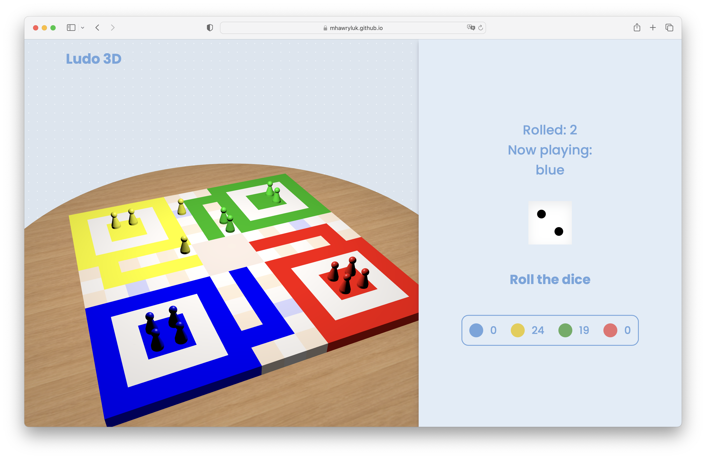

# Ludo - 3D browser game

**Ludo 3D** is a desktop browser game based on a classic board game. It offers a single-player experience, battling an AI opponent of different difficulty levels, as well as a single-device multiplayer mode. You can check it out [here](https://mhawryluk.github.io/ludo-3d/).

## Technologies used
* HTML, CSS, Vanilla JavaScript
* X3DOM
